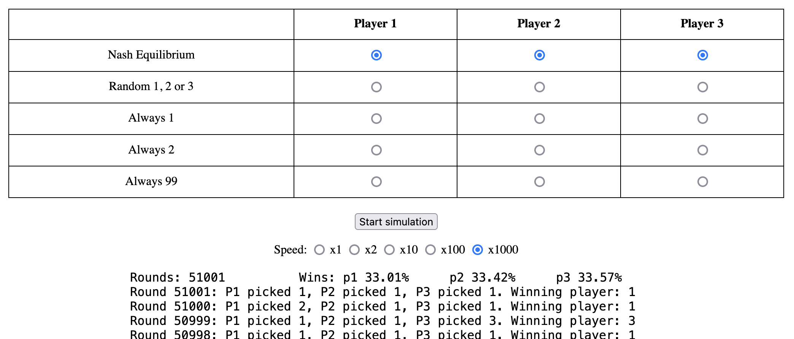
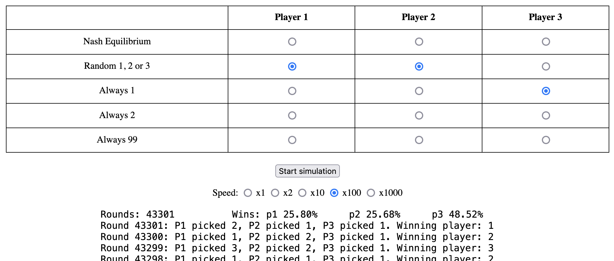
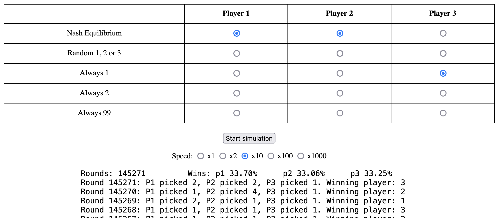

Simulation of Nash Equilibrium for a three player game.

I was watching [this video](https://www.youtube.com/watch?v=9vdElgo-xNM) by **Wrath of Math**, and wanted to write a simulation for the game.

Game rules:
* Three player each simultaneiously announce a positive integer of their choosing.
* Smallest unique number wins.
* If all players picked the same number, a random winner is chosen.

The simulation allows you to chose a strategy for each player:

# Live demo
[Click here to go to the live demo page](https://brammeerten.github.io/nash-equilibrium/).

